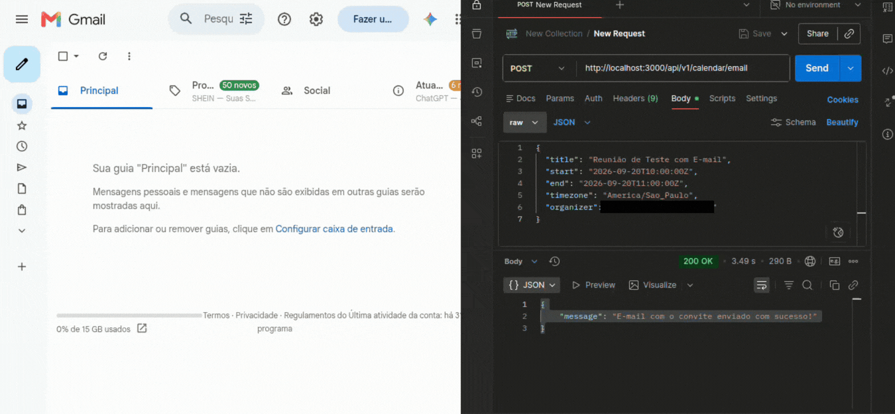

# Gerador de Calendário & Convites API

API REST desenvolvida em **TypeScript** utilizando **TDD (Test-Driven Development)**, Clean Architecture com separação de camadas, Injeção de Dependências com **TSyringe**, validações robustas com **Zod**, geração de arquivos iCalendar (`.ics`) em conformidade com a **RFC 5545** e disparo de convites por e-mail via **Nodemailer**.

---

## 🎥 Demonstração

<div align="center">
  
</div>


##  Tecnologias Utilizadas

* **Node.js** & **TypeScript**
* **Express** (Framework HTTP)
* **TSyringe** (Injeção de Dependências)
* **Zod** (Validação de Schemas e Dados)
* **Nodemailer** (Serviço de Envio de E-mails SMTP)
* **Jest** & **Supertest** (Desenvolvimento guiado por testes - TDD, com cobertura > 97%)

---

##  Arquitetura & Metodologia (TDD)

O projeto foi construído inteiramente sob a metodologia **TDD**, garantindo alta coesão, baixo acoplamento e blindagem contra regressões. As regras de negócio de domínio, geradores de infraestrutura, casos de uso e rotas E2E foram testados rigorosamente antes ou durante a implementação:

```text
src/
├── domain/               # Entidades de negócio, regras e erros personalizados
│   ├── entity/           # Ex: CalendarEvent (com cópia defensiva e validações)
│   └── error/            # Erros de domínio
├── application/          # Casos de uso e orquestração
│   ├── usecases/         # Ex: GenerateIcsUseCase, SendCalendarEmailUseCase
│   └── http/             # Controllers HTTP (Express)
├── infrastructure/       # Implementações técnicas externas
│   ├── ics/              # Serviço de geração e formatação de arquivos .ics
│   └── mail/             # Serviço de envio de e-mails via Nodemailer
├── middleware/           # Middlewares (validação de schemas Zod)
└── main.ts               # Ponto de entrada, container de DI e configuração do Express

```

---

##  Instalação e Execução

### 1. Pré-requisitos

Certifique-se de ter o **Node.js** (versão 18+) e o **npm** instalados na sua máquina.

### 2. Instalação das Dependências

Clone o repositório e instale as dependências:

```bash
npm install

```

### 3. Configuração de Variáveis de Ambiente

Crie um arquivo `.env` na raiz do projeto baseando-se no exemplo abaixo:

```env
PORT=3000
EMAIL_HOST=smtp.gmail.com
EMAIL_PORT=587
EMAIL=seu-email-secundario@gmail.com
SENHA_EMAIL=sua-senha-de-app-de-16-digitos

```

### 4. Rodando em Modo de Desenvolvimento

```bash
npm run dev

```

O servidor estará rodando em `http://localhost:3000`.

---

##  Testes Automatizados (TDD)

Desenvolvido estritamente com **TDD**, o projeto conta com uma suíte de testes robusta cobrindo Domínio, Casos de Uso, Infraestrutura e Rotas E2E.

* **Rodar todos os testes:**
```bash
npm run test

```


* **Rodar testes com relatório de cobertura:**
```bash
npm run test:cov

```


---

##  Endpoints da API

### 1. Gerar e Baixar arquivo `.ics`

* **POST** `/api/v1/calendar`
* **Body (JSON):**

```json
{
  "title": "Reunião de Planejamento",
  "start": "2026-09-10T10:00:00Z",
  "end": "2026-09-10T11:00:00Z",
  "description": "Alinhamento das sprints da semana.",
  "location": "Google Meet / Online",
  "timezone": "America/Sao_Paulo",
  "recurrence": "FREQ=WEEKLY;COUNT=4",
  "alarmMinutesBefore": 15,
  "organizer": "organizador@empresa.com",
  "attendees": ["dev1@empresa.com", "dev2@empresa.com"]
}

```

* **Resposta:** Retorna o arquivo formatado `text/calendar` pronto para importação em calendários (Google, Outlook, Apple).

### 2. Gerar e Enviar Convite por E-mail

* **POST** `/api/v1/calendar/email`
* **Body (JSON):** *(Mesma estrutura do payload acima)*
* **Resposta:** Dispara o convite `.ics` anexado diretamente para o e-mail do organizador/destinatário.

---

##  Contribuição

Projeto desenvolvido utilizando **TDD**, foco em boas práticas de engenharia de software, código limpo e alta testabilidade.

